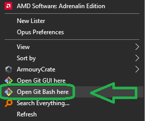
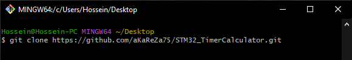
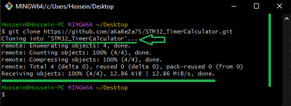
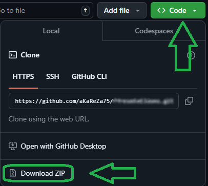
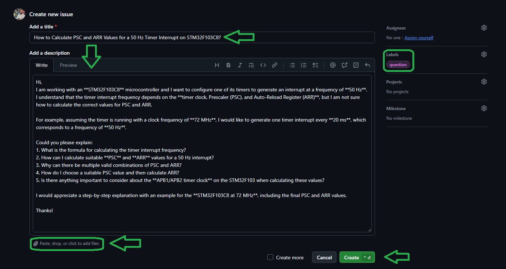

# STM32 Timer PWM Solver

A small command-line tool that finds the **Prescaler (PSC)** and **Auto-Reload (ARR)** register values for an STM32 timer, given a timer clock and a target PWM frequency (or period).

Instead of brute-forcing ~4.3 billion `PSC × ARR` combinations, it uses a vectorized NumPy search that runs in a few milliseconds.

---

## Features

- Supports **edge-aligned** (up/down count) and **center-aligned** (dual-slope) PWM modes
- Accepts the target as a **frequency or a period**, with SI prefixes (`k`, `M`, `u`, `ms`, ...)
- Output is shown in the **same kind of unit you typed** (frequency in → frequency out, time in → time out)
- Reports three results: **minimum error**, **largest PSC**, and **largest ARR**
- Optional: list **all other candidates** within the error threshold in a single table
- Interactive loop: run as many calculations as you want without restarting

---
<table>
  <tr>
  <td valign="top">
  
  > [!TIP]  
  > If you're looking to better understand how to navigate and use my GitHub repositories — including exploring their structure, downloading or cloning projects, submitting issues, and asking questions,  
  > everything you need is clearly explained in this video:  
  > [aKaReZa 95 - Programming, Git - PART B](https://youtu.be/zYiUItVFRqQ)  
  > Make sure to check it out!
  
  </td>
    <td width="360" valign="middle" style="padding: 0;">
      <a href="https://youtu.be/zYiUItVFRqQ">
       
      </a>
    </td>

  </td>
  </tr>
  <tr>
  <td colspan="2">

  > [!CAUTION]
  > It is absolutely critical that you carefully read every single word of this document, line by line, to ensure you don't miss any details. Nothing can be overlooked.
      
  </td>
  </tr>  
</table>

---


## How it works

For a timer clock `Fclk`, the PWM frequency is:

| Mode | Formula |
|------|---------|
| Edge-aligned (up or down count) | `Fpwm = Fclk / ((PSC+1) × (ARR+1))` |
| Center-aligned (dual-slope) | `Fpwm = Fclk / (2 × (PSC+1) × (ARR+1))` |

In center-aligned mode the counter counts up **and** down every period, which doubles the divider. The script handles this by searching against an effective clock of `Fclk / 2`.

Let `PR = PSC+1` and `AR = ARR+1`. For every candidate `PR` in `[1 .. 65534]`, the best matching `AR` is computed directly:

```
AR = round(Fclk_eff / (Ftarget × PR))
```

This reduces the search from O(n²) to O(n). The script then computes the resulting frequency and error for every `PR` and picks the best ones.

---

## Requirements

- Python 3.8+
- [NumPy](https://numpy.org/)

```bash
pip install numpy
```

---

## Usage

```bash
python STM32_Timer.py
```

The script asks for three inputs, then prints the results:

1. **Timer Clock** – the clock feeding the timer (e.g. `72000000` or `72Mf`)
2. **PWM Target** – desired PWM frequency or period (e.g. `20Kf`, `50f`, `20ms`)
3. **Counting mode** – `e` for edge-aligned, `c` for center-aligned

After the results table you will be asked:

- `Show all other candidates too? (y/n)` – prints every candidate within the error threshold
- `Run another calculation? (y/n)` – start over or exit

---

## Input format

The target (and the timer clock) can be typed as a frequency or a time, with an optional SI prefix:

| Suffix | Meaning |
|--------|---------|
| `f` | Frequency (Hz) |
| `s` | Time / period (seconds) |
| *(none)* | Treated as a frequency in Hz |

SI prefixes (case-sensitive):

| Prefix | Multiplier | Notes |
|--------|-----------|-------|
| `p` | 1e-12 | pico |
| `n` | 1e-9 | nano |
| `u` | 1e-6 | micro |
| `m` | 1e-3 | milli (lowercase only) |
| `k` or `K` | 1e3 | kilo |
| `M` | 1e6 | mega (uppercase only) |
| `G` | 1e9 | giga |

Examples:

| Input | Meaning |
|-------|---------|
| `50f` | 50 Hz |
| `10Kf` | 10 kHz |
| `10Mf` | 10 MHz |
| `20e-3s` | 0.02 s |
| `20ms` | 20 milliseconds |
| `20us` | 20 microseconds |
| `72000000` | 72 MHz (plain number = Hz) |

---

## Output explained

The main table contains three rows:

| Row | Description |
|-----|-------------|
| **Best (min error)** | The PSC/ARR pair with the smallest frequency error |
| **Max PR** | Among all pairs within the error threshold, the one with the largest prescaler |
| **Max AR** | Among all pairs within the error threshold, the one with the largest auto-reload value |

Columns:

| Column | Description |
|--------|-------------|
| `PSC reg` | Value to write to the timer's `PSC` register (already `PR - 1`) |
| `ARR reg` | Value to write to the timer's `ARR` register (already `AR - 1`) |
| `Fcalc` / `Tcalc` | Resulting frequency or period (depending on what you typed) |
| `Diff` | Absolute difference from the target |
| `Error (%)` | Relative error in percent |

The line `candidates within threshold` shows how many `(PSC, ARR)` pairs fall within the error threshold `Fdelta`. The threshold starts at `1e-8` Hz and is increased by a factor of 10 until at least one candidate is found (so for targets that cannot be hit exactly, you still get the closest matches).

### Why "Max PR" and "Max AR"?

Many `(PSC, ARR)` pairs can give the same frequency. Choosing a **large ARR** gives higher PWM duty-cycle resolution (more counts per period), while a **large PSC** gives a slower timer tick. Having both extremes listed makes it easy to pick the trade-off that suits your application.

---

## Examples

### Example 1 – Edge-aligned, frequency target

```
Timer Clock (e.g. 72000000, 72Mf): 72Mf
PWM Target  (e.g. 50f, 20e-3s, 20us, 10Kf): 20Kf
Counting mode - (e)dge-aligned Up/Down or (c)enter-aligned [e/c]: e

Mode: Edge-aligned (Up/Down count)
Fclk = 72.000000 MHz   Target = 20.000000 kHz
+------------------+---------+---------+---------------+-------------+-----------+
| Result           | PSC reg | ARR reg | Fcalc         | Diff        | Error (%) |
+------------------+---------+---------+---------------+-------------+-----------+
| Best (min error) | 0       | 3599    | 20.000000 kHz | 0.000000 Hz | 0.000000  |
| Max PR           | 3599    | 0       | 20.000000 kHz | 0.000000 Hz | 0.000000  |
| Max AR           | 0       | 3599    | 20.000000 kHz | 0.000000 Hz | 0.000000  |
+------------------+---------+---------+---------------+-------------+-----------+
candidates within threshold : 45  (Fdelta = 1.0e-08)
```

### Example 2 – Listing all candidates

Answering `y` to *"Show all other candidates too?"* prints every candidate in one table, sorted by error (smallest first), then by largest PR first:

```
Show all other candidates too? (y/n): y

All candidates within threshold: 45 (sorted by error, then largest PR first)
+--------+---------+---------+---------------+-------------+-----------+
| Result | PSC reg | ARR reg | Fcalc         | Diff        | Error (%) |
+--------+---------+---------+---------------+-------------+-----------+
| #1     | 3599    | 0       | 20.000000 kHz | 0.000000 Hz | 0.000000  |
| #2     | 1799    | 1       | 20.000000 kHz | 0.000000 Hz | 0.000000  |
| #3     | 1199    | 2       | 20.000000 kHz | 0.000000 Hz | 0.000000  |
| ...    | ...     | ...     | ...           | ...         | ...       |
| #23    | 59      | 59      | 20.000000 kHz | 0.000000 Hz | 0.000000  |
| ...    | ...     | ...     | ...           | ...         | ...       |
| #43    | 2       | 1199    | 20.000000 kHz | 0.000000 Hz | 0.000000  |
| ...    | ...     | ...     | ...           | ...         | ...       |
+--------+---------+---------+---------------+-------------+-----------+
```

*(Output shortened here for readability.)*

### Example 3 – Center-aligned, period target

When the target is a time, results are shown as periods:

```
Timer Clock (e.g. 72000000, 72Mf): 72Mf
PWM Target  (e.g. 50f, 20e-3s, 20us, 10Kf): 20ms
Counting mode - (e)dge-aligned Up/Down or (c)enter-aligned [e/c]: c

Mode: Center-aligned (dual-slope)
Fclk = 72.000000 MHz   Target = 20.000000 ms
+------------------+---------+---------+--------------+-------------+-----------+
| Result           | PSC reg | ARR reg | Tcalc        | Diff        | Error (%) |
+------------------+---------+---------+--------------+-------------+-----------+
| Best (min error) | 11      | 59999   | 20.000000 ms | 0.000000 ps | 0.000000  |
| Max PR           | 59999   | 11      | 20.000000 ms | 0.000000 ps | 0.000000  |
| Max AR           | 11      | 59999   | 20.000000 ms | 0.000000 ps | 0.000000  |
+------------------+---------+---------+--------------+-------------+-----------+
candidates within threshold : 102  (Fdelta = 1.0e-08)
```

Here a 20 ms period means 50 Hz. With a 72 MHz clock in center-aligned mode, `PSC = 11` and `ARR = 59999` give `72 MHz / (2 × 12 × 60000) = 50 Hz`.

---

## Using the result in STM32 code

Write the register values directly, or via the HAL:

```c
// HAL (example for TIM1)
htim1.Instance->PSC = 0;      // "PSC reg" column
htim1.Instance->ARR = 3599;   // "ARR reg" column

// or in CubeMX / HAL init structure
htim1.Init.Prescaler = 0;
htim1.Init.Period    = 3599;
```

For center-aligned PWM, set the counter mode accordingly:

```c
htim1.Init.CounterMode = TIM_COUNTERMODE_CENTERALIGNED1;
```

---

# 🔗 Resources
  Here you'll find a collection of useful links and videos related to this topic.
 
<table>  
  <tr>
    <td valign="top" style="padding: 0 10px;">
      <h3 style="margin: 0;">
        <a href="https://youtu.be/KfNeLlAj2PU">aKaReZa 144 – STM32, HAL, Timer, Accurate Time - Mode 1</a>
      </h3>
      <p style="margin: 8px 0 0;">
        Learn the fundamentals of <strong>STM32 timers</strong> and how to build accurate timing systems using the HAL library. This episode covers the different timer categories, timer architecture, clock configuration, timing calculations, and HAL timer APIs. You'll also see how timers can be used to <strong>refresh a 7-segment display</strong> and create precise scheduling mechanisms for embedded applications.
      </p>
    </td>
    <td width="360" valign="top">
      <a href="https://youtu.be/KfNeLlAj2PU">
        
      </a>
    </td>

</table>


# 💻 How to Use Git and GitHub
To access the repository files and save them on your computer, there are two methods available:
1. **Using Git Bash and Cloning the Repository**
   - This method is more suitable for advanced users and those familiar with command-line tools.
   - By using this method, you can easily receive updates for the repository.

2. **Downloading the Repository as a ZIP file**
   - This method is simpler and suitable for users who are not comfortable with command-line tools.
   - Note that with this method, you will not automatically receive updates for the repository and will need to manually download any new updates.

## Clone using the URL.
First, open **Git Bash** :
-  Open the folder in **File Explorer** where you want the library to be stored.
-  **Right-click** inside the folder and select the option **"Open Git Bash here"** to open **Git Bash** in that directory.



> [!NOTE] 
> If you do not see the "Open Git Bash here" option, it means that Git is not installed on your system.  
> You can download and install Git from [this link](https://git-scm.com/downloads).  
> For a tutorial on how to install and use Git, check out [this video](https://youtu.be/BsykgHpmUt8).
  
-  Once **Git Bash** is open, run the following command to clone the repository:

 ```bash
git clone https://github.com/aKaReZa75/STM32_TimerCalculator.git
```
- You can copy the above command by either:
- Clicking on the **Copy** button on the right of the command.
- Or select the command text manually and press **Ctrl + C** to copy.
- To paste the command into your **Git Bash** terminal, use **Shift + Insert**.



- Then, press Enter to start the cloning operation and wait for the success message to appear.



> [!IMPORTANT]
> Please keep in mind that the numbers displayed in the image might vary when you perform the same actions.  
> This is because repositories are continuously being updated and expanded. Nevertheless, the overall process remains unchanged.

> [!NOTE]
> Advantage of Cloning the Repository:  
> - **Receiving Updates:** By cloning the repository, you can easily and automatically receive new updates.  
> - **Version Control:** Using Git allows you to track changes and revert to previous versions.  
> - **Team Collaboration:** If you are working on a project with a team, you can easily sync changes from team members and collaborate more efficiently.  

## Download Zip
If you prefer not to use Git Bash or the command line, you can download the repository directly from GitHub as a ZIP file.  
Follow these steps:  
1. Navigate to the GitHub repository page and Locate the Code button:
   - On the main page of the repository, you will see a green Code button near the top right corner.

2. Download the repository:
   - Click the Code button to open a dropdown menu.
   - Select Download ZIP from the menu.

    

3. Save the ZIP file:
   - Choose a location on your computer to save the ZIP file and click Save.

4. Extract the ZIP file:
   - Navigate to the folder where you saved the ZIP file.
   - Right-click on the ZIP file and select Extract All... (Windows) or use your preferred extraction tool.
   - Choose a destination folder and extract the contents.

5. Access the repository:
   - Once extracted, you can access the repository files in the destination folder.

> [!IMPORTANT]
> - No Updates: Keep in mind that downloading the repository as a ZIP file does not allow you to receive updates.    
>   If the repository is updated, you will need to download it again manually.  
> - Ease of Use: This method is simpler and suitable for users who are not comfortable with Git or command-line tools.

# 📝 How to Ask Questions
If you have any questions or issues, you can raise them through the **"Issues"** section of this repository. Here's how you can do it:  

1. Navigate to the **"Issues"** tab at the top of the repository page.  

  

2. Click on the **"New Issue"** button.  
   
  

3. In the **Title** field, write a short summary of your issue or question.  

4. In the "Description" field, detail your question or issue as thoroughly as possible. You can use text formatting, attach files, and assign the issue to someone if needed. You can also use text formatting (like bullet points or code snippets) for better readability.  

5. Optionally, you can add **labels**, **type**, **projects**, or **milestones** to your issue for better categorization.  

6. Click on the **"Submit new issue"** button to post your question or issue.
   
  

I will review and respond to your issue as soon as possible. Your participation helps improve the repository for everyone!  

> [!TIP]
> - Before creating a new issue, please check the **"Closed"** section to see if your question has already been answered.  
>     
> - Write your question clearly and respectfully to ensure a faster and better response.  
> - While the examples provided above are in English, feel free to ask your questions in **Persian (فارسی)** as well.  
> - There is no difference in how they will be handled!  

> [!NOTE]
> Pages and interfaces may change over time, but the steps to create an issue generally remain the same.

# 🤝 Contributing to the Repository
To contribute to this repository, please follow these steps:
1. **Fork the Repository**  
2. **Clone the Forked Repository**  
3. **Create a New Branch**  
4. **Make Your Changes**  
5. **Commit Your Changes**  
6. **Push Your Changes to Your Forked Repository**  
7. **Submit a Pull Request (PR)**  

> [!NOTE]
> Please ensure your pull request includes a clear description of the changes you’ve made.
> Once submitted, I will review your contribution and provide feedback if necessary.

# 🌟 Support Me
If you found this repository useful:
- Subscribe to my [YouTube Channel](https://www.youtube.com/@aKaReZa75).
- Share this repository with others.
- Give this repository and my other repositories a star.
- Follow my [GitHub account](https://github.com/aKaReZa75).

# 📜 License
This project is licensed under the GPL-3.0 License. This license grants you the freedom to use, modify, and distribute the project as long as you:
- Credit the original authors: Give proper attribution to the original creators.
- Disclose source code: If you distribute a modified version, you must make the source code available under the same GPL license.
- Maintain the same license: When you distribute derivative works, they must be licensed under the GPL-3.0 too.
- Feel free to use it in your projects, but make sure to comply with the terms of this license.
  
# ✉️ Contact Me
Feel free to reach out to me through any of the following platforms:
- 📧 [Email: aKaReZa75@gmail.com](mailto:aKaReZa75@gmail.com)
- 🎥 [YouTube: @aKaReZa75](https://www.youtube.com/@aKaReZa75)
- 💼 [LinkedIn: @akareza75](https://www.linkedin.com/in/akareza75)
